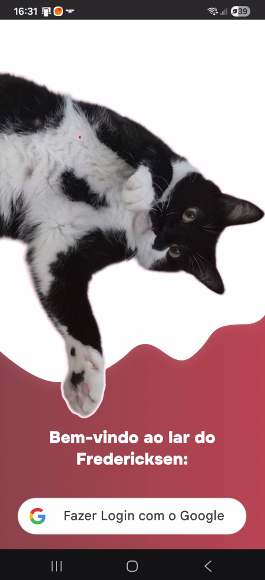

# 🌸 Fredericksen

O **Fredericksen** é um aplicativo PWA que leva o nome do gato da minha família (dono do lar) e nasceu do desejo de facilitar o dia a dia da minha casa. A ideia é criar um espaço onde possamos nos organizar melhor, crescendo aos poucos através das conversas e necessidades reais que observo em casa.

Optei por desenvolver esse app tendo em vista os desafios e apredizados:

- (Portabilidade) Uso de celulares Android e IOS pelos familiares.
- (Acessibilidade) Usuários com idade entre 8 e 62 anos de diferentes areas e com diferentes graus de familiaridade com tecnologia.

---

## (Versão 0.2.0)



### Funcionalidades

- **Login com Google:** Integração com o Google Identity Services para acesso sem necessidade de criar novas senhas.
- **Proteção de Acesso:** Uso de travas de segurança (Guards) que garantem que as páginas internas só sejam acessadas por quem estiver autenticado.
- **Identificação do Usuário:** A tela inicial identifica automaticamente quem entrou e exibe o nome do familiar logado.
- **Feedback de Carregamento:** Exibição de mensagens de "Carregando" e "Realizando login" para indicar que o sistema está processando as informações.

### Engenharia e Arquitetura

- **Testes unitarios:** Cobertura inicial de testes unitários configurada para componentes e serviços essenciais (`.spec.ts`).
- **CI/CD e Deploy Automático:** Automação de entrega guiada por um fluxo de trabalho maduro (Git Flow). O desenvolvimento ocorre isolado em branches de `feature` e é consolidado na `develop`. O deploy para produção é acionado de forma 100% automática apenas no fechamento seguro de uma branch de `release`, sendo estritamente condicionado à aprovação prévia em todos os testes unitarios.
- **PWA (Progressive Web App):** Service Workers configurados (`ngsw-config.json`) para pré-carregamento de assets e funcionamento otimizado.
- **Segurança e Isolamento:** Separação clara de variáveis de ambiente entre desenvolvimento e produção (`environment.ts` e `environment.development.ts`).
- **Código Limpo:** TypeScript e Angular configurados com tipagem estrita (`"strict": true`) para prevenção de bugs.

---

## Visão Geral

O Fredericksen foi idealizado para ser um **Hub Pessoal e Familiar**, atuando como um portal centralizador para diversas ferramentas e utilidades do cotidiano. A proposta arquitetônica é criar uma base sólida, segura e escalável, onde diferentes módulos (ou "mini-apps") possam conviver dentro da mesma plataforma, compartilhando o mesmo sistema de autenticação e identidade visual.

Atualmente, o roadmap do projeto foca no desenvolvimento de três módulos iniciais:

- **Livro de Receitas:** Um espaço dedicado para digitalizar, organizar e facilitar acesso as ao caderno de receitas da minha mãe.

- **Lembretes e Avisos:** Um painel ou mural virtual para gestão de recados importantes, tarefas e compromissos do dia a dia.

- **Tábua das Marés para Mangue:** Uma ferramenta utilitária e específica para consulta rápida das condições e níveis da maré, facilitando o planejamento de atividades no manguezal.

Toda essa estrutura foi pensada utilizando a navegação reativa do Angular e suporte a PWA (Progressive Web App), permitindo que o Hub funcione de forma rápida, instalável e fluida, oferecendo a experiência de um aplicativo nativo no celular dos usuários.

---

## Estrutura do Projeto

```bash
|   custom-theme.scss
|   index.html
|   main.ts
|   styles.css
|
+---app
|   |   app.config.ts
|   |   app.css
|   |   app.html
|   |   app.routes.ts
|   |   app.spec.ts
|   |   app.ts
|   |   auth-guard.spec.ts
|   |   auth-guard.ts
|   |
|   +---core
|   |   \---services
|   |       +---auth
|   |       |       auth.spec.ts
|   |       |       auth.ts
|   |       |       google-auth-script.spec.ts
|   |       |       google-auth-script.ts
|   |       |
|   |       \---shared
|   |           +---logger
|   |           |       logger.spec.ts
|   |           |       logger.ts
|   |           |
|   |           \---notification
|   |                   notification.spec.ts
|   |                   notification.ts
|   |
|   \---pages
|       +---home
|       |       home.css
|       |       home.html
|       |       home.spec.ts
|       |       home.ts
|       |
|       \---login
|               login.css
|               login.html
|               login.spec.ts
|               login.ts
|
\---environments
        environment.development.ts
        environment.ts

```

---

## Tecnologias Utilizadas

- **Angular:** Framework principal com inicialização via bootstrapApplication e detecção de mudança otimizada.
- **Firebase & Angular Fire:** Configurado para inicialização de app e gerenciamento do estado de autenticação.
- **Google Identity Services (GIS):** Biblioteca carregada dinamicamente para renderização do botão de login nativo do Google.
- **TypeScript & RxJS:** Tipagem estática e programação reativa usando BehaviorSubject para controle de estado do usuário.
- **CSS3 / SCSS:** Estilização com variáveis CSS nativas (ex: --lavander-blush) e animações em keyframes.
- **Jasmine & Karma:** Framework e test runner utilizados para a criação e execução dos testes unitários, garantindo a qualidade e prevenindo regressões no código.
- **Git & Git Flow:** Controle de versão distribuído aliado a um fluxo de trabalho estruturado, garantindo organização e isolamento seguro entre o desenvolvimento de *features* e as integrações na *develop*.

---

Por Thaissa Leslye e Família 🩷
